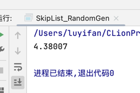
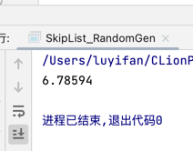
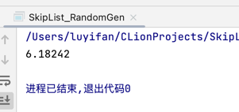
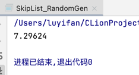
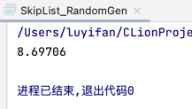

# SkipList
## some new knowledge
### 新随机数生成器 V1
```cpp
int randomLevel() { // func random level
    int random_level = 1;
    int seed = time(NULL);
    static std::default_random_engine e(seed);
    static std::uniform_int_distribution<int> u(0, 1);

    while (u(e) && random_level < maxLevel)
            random_level++;

    return random_level;
};
```
#### static std::default_random_engine e(seed)
* 定义在`<random>`随机数库
* 定义为`static`,否则每次调用函数都会生成相同的序列
* 设置种子：
  * 创建引擎对象提供种子`Engine e(s)`
  * 调用引擎的seed成员`e.seed(s)`
  * **最常用调用系统函数time**
```cpp
#include <ctime>
static default_tandom_engine e(time(0));
```
#### static std::uniform_int_distribution<int> u(0,1);
**整数均匀分布**
* `uniform_int_distribution`随机数生成范围是闭区间`[]`
* `uniform_real_distribution`生成范围是半开区间`[)`

### 随机数生成器 V2
```cpp
int main(){
int randomLevel = 1;
    int ans[1000];
    for(int i = 1; i < 1000; i++) {
        ans[i] = rand() % 4;
        cout << ans[i];
    }
    cout << endl;
    int cnt = 1;
    for(int i = 1; i < 100; i++) {
//        cout << ans[i];
        while (ans[cnt++] == 0)
            randomLevel++;
        cout << randomLevel;
        randomLevel = 1;
    }
    return 0;
}
 ```
朴素且稳定

## 实验步骤
**进行试验**

`p = 1/2`

`SKIP_LISTS_P = 2`

|  size  |   50    |   100   |   200   |   500   |  10000  |
|:------:|:-------:|:-------:|:-------:|:-------:|:-------:|
| 平均搜索次数 | 4.38007 | 6.78594 | 6.18242 | 7.29624 | 8.69706 |
|  png   ||||||

`p = 1/e`

`SKIP_LISTS_P = 3`

|  size  | 50 |   100   |   200   |   500   |  1000  |
|:------:|:--:|:-------:|:-------:|:-------:|:-------:|
| 平均搜索次数 | 4.18118 | 5.82873 | 8.19699 | 9.21838 | 12.9359 |

`p = 1/4`

`SKIP_LISTS_P = 4`

|  size  |   50    |   100   |   200   |  500   |  10000  |
|:------:|:-------:|:-------:|:-------:|:------:|:-------:|
| 平均搜索次数 | 5.83291 | 6.35752 | 7.91722 | 9.8117 | 11.9609 |

`p = 1/8`

`SKIP_LISTS_P = 8`

|  size  |   50    |   100    |   200   |   500   |  10000  |
|:------:|:-------:|:--------:|:-------:|:-------:|:-------:|
| 平均搜索次数 | 8.38513 | 8.38513  | 10.4559 | 17.4028 | 23.0041 |


* 搜索次数:`100000`
* 平均搜索次数：进入搜索函数后搜索执行次数/100000
* 图片过多，文件结构太乱，所以我就不插入图片，由于我用的随机数生成器是`rand()`并且没有使用文件读写，所以你可以直接复制过来跑我的程序，那么跑一遍便是我输出的数据


### 程序验证指南

1. 下载`main.cpp`
2. 运行
3. 修改参数：`SKIP_LISTS_SIZE`, `SKIP_LISTS_P`
4. 运行

## 实验结果
### 实验结果图像
### 实验结果分析

## 代码分析
**find**
```cpp
skipNode<T> *find(int k, int &cnt) {
        skipNode<T> * tmp = head;
        int currentLevel = nodeLevel(tmp->next);
        for(int i = (currentLevel - 1); i > -1 ;i--) {
            while (tmp->next[i] != nullptr && tmp->next[i]->key < k) {
                tmp = tmp->next[i];
                cnt++;
            }
        }
        tmp = tmp->next[0];
        if(tmp->key == k) return tmp;
        else return nullptr;
    };
//思路：下楼梯，能在上面走就在上面走，否则下楼
```
**Insert**
```cpp
skipNode<T> *insert(int k, T v) { // insert or update
        //get new node random level
        int x_level = randomLevel();
        skipNode<T> *newNode = nullptr;
        skipNode<T> *tmp = head;
        int tt;
        newNode = find(k, tt);
        // find() to judge the node exists, yep : update
        //                                  nope: insert
        if (newNode) {//then lets update
            newNode->val = v;
            return head;
        }
            //then lets insert
        newNode = new skipNode<T>(k, v, x_level);
        for (int i = x_level - 1; i > -1; i--) {
            //find the suit position to insert
            while (tmp->next[i] != nullptr && tmp->next[i]->key < k)
                tmp = tmp->next[i];
            newNode->next[i] = tmp->next[i];
            tmp->next[i] = newNode;
        }
        return head;
    };
//思路：找到位置后，随机生成节点楼层
```
## 测试用例
```c++
for(size_t i = 0; i < SKIP_LISTS_SIZE; i++) {
        l.insert(i, i);
}
```
维持链表有序性，且保持较高的时间复杂度，这里若想实现随机性略有画蛇添足且有可能溢出


